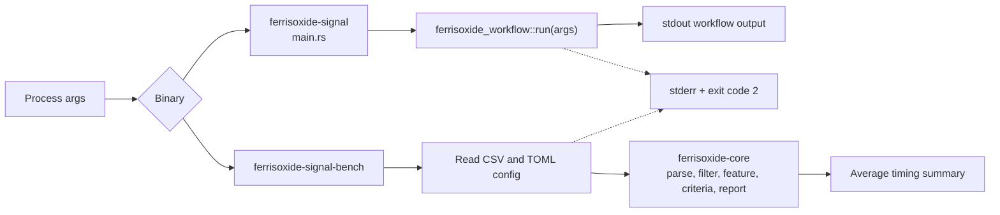

# ferrisoxide-cli Architecture

Date: 2026-06-06

## Responsibility

`ferrisoxide-cli` owns desktop command-line binaries. The main `ferrisoxide-signal` binary is a thin terminal adapter over `ferrisoxide-workflow`. The `ferrisoxide-signal-bench` helper measures local CSV/config read, parse, transform, criteria, report, and total timing.

## Non-Goals

- Core analysis semantics, GUI behavior, schema ownership, DAQ acquisition, hardware runtime loading, installer packaging, release publication, or certification evidence.

## Public Boundary

| Binary | Boundary |
|---|---|
| `ferrisoxide-signal` | Reads process args, calls `ferrisoxide_workflow::run`, prints success to stdout or errors to stderr, returns exit code 0 or 2. |
| `ferrisoxide-signal-bench` | Reads `--input`, `--config`, and `--iterations`, runs the core pipeline repeatedly, prints timing summary, returns exit code 0 or 2. |

## Flowchart

## Important Error Paths

- The main binary delegates all workflow validation and errors to `ferrisoxide-workflow`.
- The benchmark helper rejects missing `--input` or `--config`, invalid or zero `--iterations`, invalid TOML, invalid config, invalid waveform parsing, transform failures, analysis failures, and JSON report rendering failures.

## Validation

- `cargo test -p ferrisoxide-cli`
- `cargo run -p ferrisoxide-cli -- --help`
- `cargo run -p ferrisoxide-cli --bin ferrisoxide-signal-bench -- --help`
- `cargo clippy --workspace --all-targets -- -D warnings`
