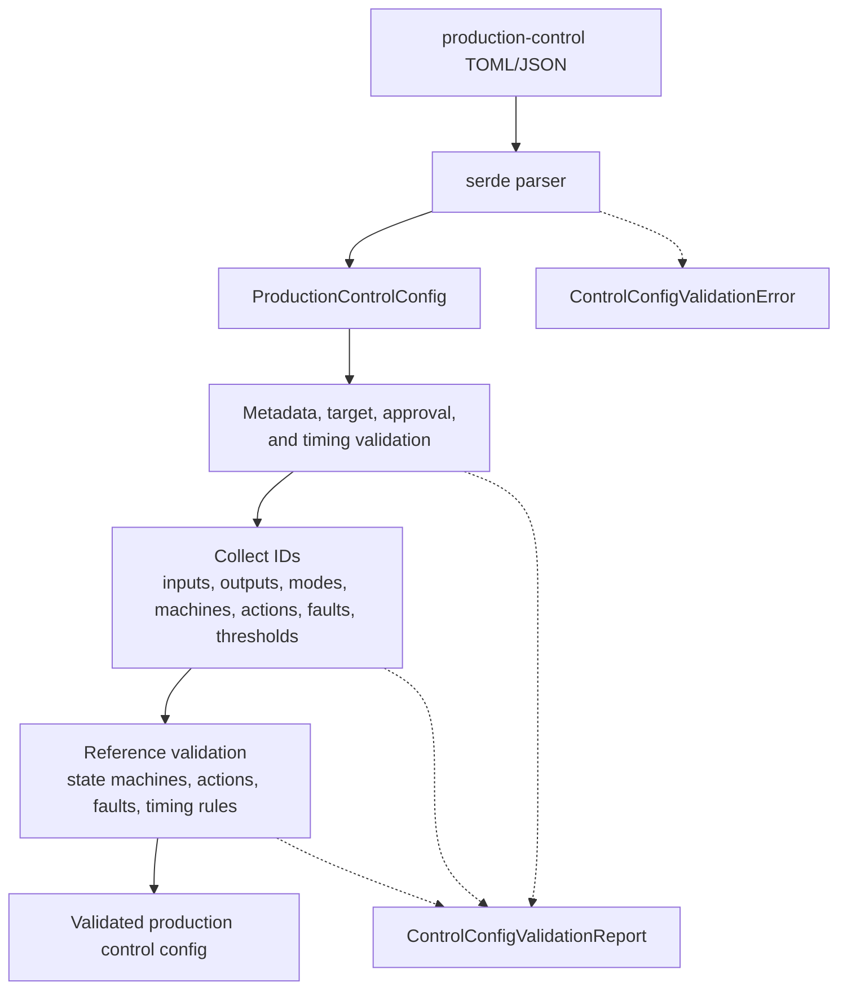

# ferrisoxide-control-schema Architecture

Date: 2026-06-06

## Responsibility

`ferrisoxide-control-schema` owns the versioned production control config schema for controller workflow planning and simulation inputs. It parses JSON/TOML, validates package metadata, target profile, approval metadata, timing, inputs, outputs, thresholds, modes, state machines, timing rules, actions, and fault responses.

## Non-Goals

- Controller execution, waveform CSV parsing, test verification criteria evaluation, DAQ/hardware I/O, HALs, RTOS SDKs, report rendering, or certification evidence.

## Public Boundary

| Area | Public API |
|---|---|
| Config root | `ProductionControlConfig`, `CURRENT_CONTROL_SCHEMA_VERSION` |
| Parsing | `parse_control_config_json`, `parse_control_config_toml` |
| Validation | `ProductionControlConfig::validate`, `ControlConfigValidationReport` |
| Control model | package, target, approval, timing, input, output, threshold, mode, state-machine, action, and fault-response types |
| Errors | `ControlConfigValidationError`, `ControlConfigValidationErrorKind` |

## Flowchart

## Important Error Paths

- Parse failures return a single `ControlConfigValidationError`.
- Validation reports can include schema-version mismatch, missing input/output/mode/state machine, duplicate identifiers, invalid timing, invalid unit values, invalid state-machine references, unknown actions, and invalid fault responses.

## Validation

- `cargo test -p ferrisoxide-control-schema`
- `cargo clippy -p ferrisoxide-control-schema --all-targets -- -D warnings`
