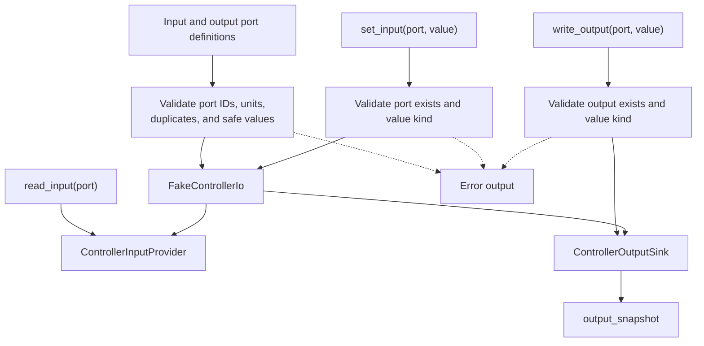

# ferrisoxide-controller-io Architecture

Date: 2026-06-06

## Responsibility

`ferrisoxide-controller-io` owns host-checkable controller input/output abstractions. It defines typed input/output ports, signal/value kinds, input provider and output sink traits, and a fake controller I/O implementation for deterministic tests and workflow simulations.

## Non-Goals

- HAL binding, RTOS SDK integration, hardware timing guarantees, unsafe FFI, Zephyr production support, live controller execution, or certification evidence.

## Public Boundary

| Area | Public API |
|---|---|
| Ports | `ControllerInputPort`, `ControllerOutputPort`, `ControllerSignalKind` |
| Values | `ControllerIoValue` |
| Traits | `ControllerInputProvider`, `ControllerOutputSink` |
| Fake I/O | `FakeControllerIo::new`, `set_input`, `apply_safe_outputs`, `read_input`, `write_output`, `output_snapshot` |
| Errors | `ControllerIoError` |

## Flowchart

## Important Error Paths

- Construction rejects empty port IDs, empty units, duplicate input/output ports, and invalid safe output values.
- Reads reject unknown or unset inputs.
- Writes reject unknown outputs, value-kind mismatches, non-finite analog/PWM values, or invalid PWM duty cycles.

## Validation

- `cargo test -p ferrisoxide-controller-io`
- `cargo clippy -p ferrisoxide-controller-io --all-targets -- -D warnings`
