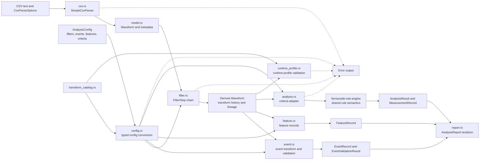

# ferrisoxide-core Architecture

Date: 2026-06-06

## Responsibility

`ferrisoxide-core` owns the desktop signal-analysis core: waveform data models, CSV parsing, TOML-backed analysis config structures, filter and transform execution, feature/event extraction, criteria evaluation adapters, report rendering, runtime-profile validation, and the transform catalog.

## Non-Goals

- Native GUI rendering, CLI argument dispatch, bundle file orchestration, DAQ acquisition, controller simulation, SVG drawing, embedded HAL integration, runtime loader execution, release packaging, or certification evidence.
- `no_std` runtime execution. Runtime-compatible semantics live in `ferrisoxide-rule-engine`, `ferrisoxide-signal`, and `ferrisoxide-embedded`.

## Public Boundary

| Area | Public API |
|---|---|
| Waveform model | `Unit`, `Channel`, `Waveform`, `WaveformMetadata`, transform metadata types in `model.rs` |
| CSV parsing | `CsvParseOptions`, `WaveformParser`, `SimpleCsvParser` |
| Config | `AnalysisConfig`, `InputConfig`, `FilterConfig`, event/feature/criteria config types |
| Transform pipeline | `Filter`, `FilterStep`, `apply_filter_chain`, event and feature transform APIs |
| Analysis | `evaluate_criteria`, `evaluate_criteria_with_measurements`, `CriteriaEvaluation`, `AnalysisResult` |
| Reports | `AnalysisReport`, `ReportEvidenceContext` |
| Runtime profiles | `validate_waveform_metadata_runtime_profile`, `validate_transform_runtime_profile` |
| Catalog | `transform_catalog`, `transform_catalog_entry`, implemented/package-supported transform lists |
| Errors | `WaveformError`, `Result<T>` |

## Flowchart

## Important Error Paths

- CSV parsing rejects empty input, non-ASCII delimiters, missing columns, invalid numbers, and CSV reader errors through `WaveformError`.
- Waveform construction rejects empty samples, channel/sample length mismatches, non-finite values, and invalid time axes.
- Config conversion rejects invalid filter, feature, event, criterion, tolerance, and runtime-profile parameters.
- Transform execution preserves raw input by producing derived waveforms and can reject invalid sample timing, non-finite transform outputs, unsupported channel scoping, or invalid parameters.
- Criteria evaluation maps `ferrisoxide-rule-engine` errors back into `WaveformError`.

## Validation

- `cargo test -p ferrisoxide-core`
- `cargo test -p ferrisoxide-core runtime_profile -- --nocapture`
- `cargo test --workspace`
- `cargo clippy --workspace --all-targets -- -D warnings`
