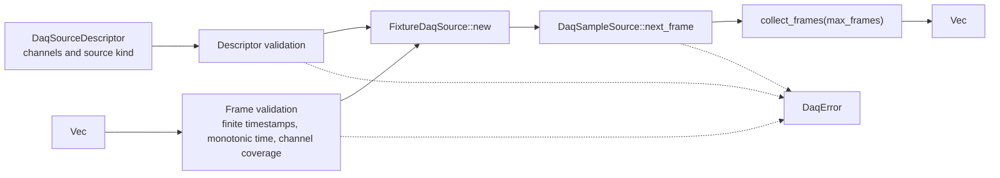

# ferrisoxide-daq Architecture

Date: 2026-06-06

## Responsibility

`ferrisoxide-daq` owns a deterministic DAQ abstraction for fixture and test-double workflows. It models DAQ channels, sample frames, source descriptors, sample sources, fixture validation, and bounded frame collection.

## Non-Goals

- Vendor SDKs, drivers, live hardware acquisition, global setup, HALs, RTOS bindings, OS-specific device APIs, calibration, or certification evidence.

## Public Boundary

| Area | Public API |
|---|---|
| DAQ data model | `DaqChannel`, `DaqSampleFrame`, `DaqSampleValue`, `DaqSourceDescriptor`, `DaqSourceKind` |
| Source trait | `DaqSampleSource` |
| Fixture source | `FixtureDaqSource::new`, `reset`, `next_frame` |
| Collection | `collect_frames` |
| Errors | `DaqError` |

## Flowchart

## Important Error Paths

- Descriptor validation rejects empty channel lists, empty IDs/sources/units, and duplicate channel IDs.
- Fixture validation rejects empty frames, non-finite timestamps, non-monotonic time, missing channel values, and non-finite analog values.
- `DaqSourceKind::FutureVendorSdk` is a descriptor category only; no vendor SDK integration exists.

## Validation

- `cargo test -p ferrisoxide-daq`
- `cargo clippy -p ferrisoxide-daq --all-targets -- -D warnings`
