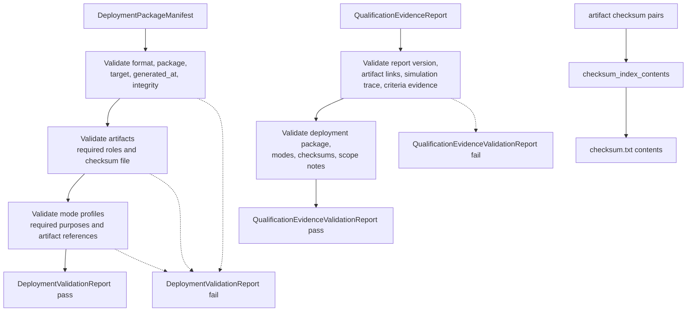

# ferrisoxide-deployment Architecture

Date: 2026-06-06

## Responsibility

`ferrisoxide-deployment` owns reviewable deployment package manifest and qualification evidence report data structures. It validates required deployment artifact roles, mode profiles, checksum index contents, and qualification evidence consistency for software-generated package evidence.

## Non-Goals

- Exporting packages, signing artifacts, runtime loading, HAL/RTOS integration, hardware execution, release publication, or certification/qualification claims.

## Public Boundary

| Area | Public API |
|---|---|
| Deployment manifest | `DeploymentPackageManifest`, package/target/mode/artifact/integrity types |
| Qualification report | `QualificationEvidenceReport` and qualification evidence structures |
| Validation | `DeploymentPackageManifest::validate`, `QualificationEvidenceReport::validate` |
| Helpers | `required_artifact_roles`, `required_mode_purposes`, `checksum_index_contents` |
| Errors | `DeploymentValidationReport`, `QualificationEvidenceValidationReport` and error kinds |

## Flowchart

## Important Error Paths

- Deployment validation reports format-version mismatches, missing required artifact roles, invalid integrity metadata, missing mode purposes, and mode references to unavailable artifact roles.
- Qualification evidence validation reports missing artifact links, missing/invalid simulation trace evidence, criteria evidence gaps, checksum evidence gaps, and inconsistent outcome evidence.
- Checksums are evidence-index values only; they are not cryptographic signing or tamper-proofing.

## Validation

- `cargo test -p ferrisoxide-deployment`
- `cargo clippy -p ferrisoxide-deployment --all-targets -- -D warnings`
