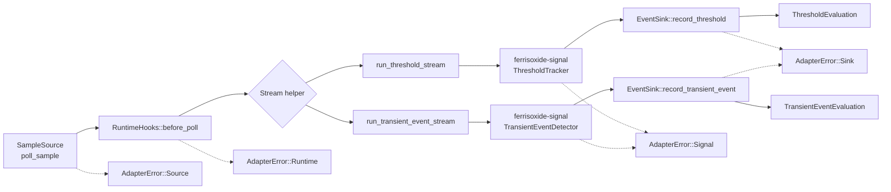

# ferrisoxide-embedded Architecture

Date: 2026-06-06

## Responsibility

`ferrisoxide-embedded` owns `no_std` adapter traits over `ferrisoxide-signal` primitives. It defines sample-source, event-sink, and runtime-hook boundaries plus simple slice/no-op/last-result test adapters for host-checkable embedded workflow validation.

## Non-Goals

- CSV parsing, file I/O, allocation, plotting, hardware HAL binding, RTOS APIs, live hardware timing guarantees, runtime loader implementation, or certification evidence.

## Public Boundary

| Area | Public API |
|---|---|
| Adapter traits | `SampleSource`, `EventSink`, `RuntimeHooks` |
| Test adapters | `SliceSampleSource`, `NoopRuntime`, `LastResultSink` |
| Streaming helpers | `run_threshold_stream`, `run_transient_event_stream` |
| Errors | `AdapterError`, `StreamResult` |

## Flowchart

## Important Error Paths

- Source, sink, runtime, and signal errors stay distinct in `AdapterError`.
- Empty transient streams return `AdapterError::Signal(SignalError::EmptyInput)`.
- Host tests use `SliceSampleSource`, `NoopRuntime`, and `LastResultSink`; production HAL/RTOS adapters are not implemented.

## Validation

- `cargo test -p ferrisoxide-embedded`
- `cargo clippy -p ferrisoxide-embedded --all-targets -- -D warnings`
