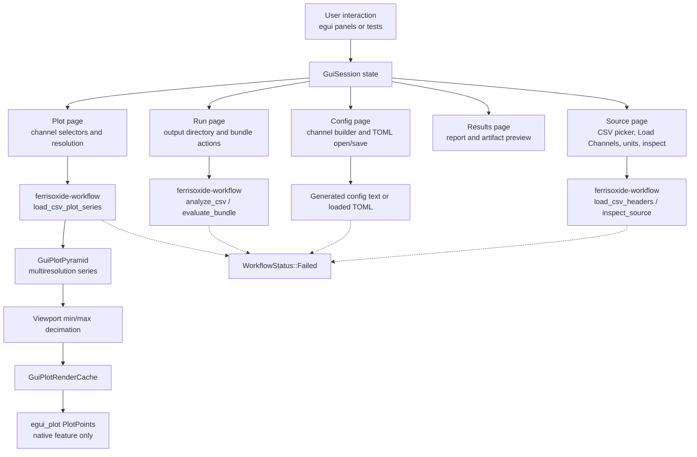

# ferrisoxide-gui Architecture

Date: 2026-06-06

## Responsibility

`ferrisoxide-gui` owns the optional native egui workflow shell and GUI state model. The library exposes `GuiSession`, dropdown/numeric configuration drafts, Source/Config/Run/Results/Plot state, channel selection, config generation, bundle execution, plot series loading, viewport-aware decimation, render caching, and plot pyramids. The `native` feature adds the eframe app, egui panels, native file/folder dialogs, and `egui_plot` rendering.

## Non-Goals

- Core waveform semantics, CLI dispatch, live DAQ support, GUI packaging/installers/signing, runtime-loader execution, hardware acquisition, or certification evidence.

## Public Boundary

| Area | Public API |
|---|---|
| Session state | `GuiSession`, `GuiTab`, `WorkflowStatus`, `GuiSourceMode` |
| Source controls | CSV headers, channel/unit selections, Source inspection methods |
| Config controls | `GuiConfigDraft`, filter/criterion draft enums, generated TOML text |
| Run/results controls | `AnalyzeCsvRequest`, `EvaluateBundleRequest` use through workflow helpers |
| Plot controls | `GuiPlotResolution`, `GuiPlotPyramid`, `GuiRenderedPlotSeries`, render cache |
| Native app | `native::run()` behind `native`; binary stub errors when feature is disabled |

## Flowchart

## Important Error Paths

- CSV channel loading is limited to CSV source mode and requires a selected input path.
- Config generation is limited to CSV source mode, requires a time column, enabled source channels, and numeric draft values.
- Run actions require a config path for CSV and an output directory; simulation mode additionally requires control config, verification config, channel map, and optional mode.
- Plot actions are currently limited to CSV sources and require at least one selected channel.
- Native file/folder pickers only update local paths; they do not add packaging, signing, live DAQ, or hardware permissions.

## Validation

- `cargo test -p ferrisoxide-gui`
- `cargo clippy -p ferrisoxide-gui --all-targets --features native -- -D warnings`
- `cargo run -p ferrisoxide-gui --features native`
