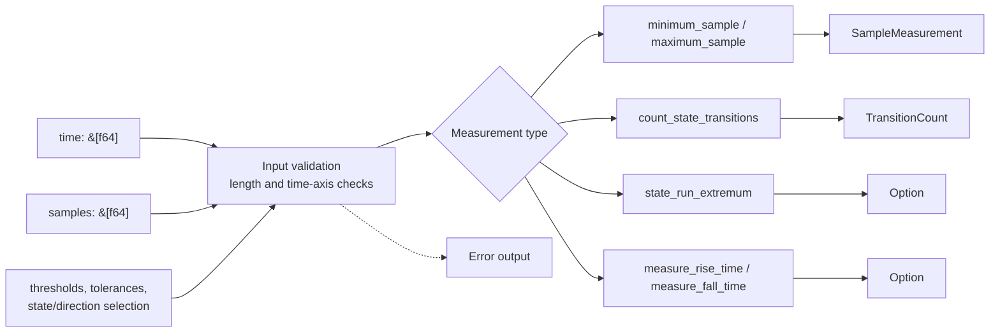

# ferrisoxide-measurements Architecture

Date: 2026-06-06

## Responsibility

`ferrisoxide-measurements` owns reusable `no_std` measurement primitives over caller-provided time and sample slices. It computes extrema, transition counts, state-run durations, and rise/fall timing evidence used by desktop criteria and shared rule semantics.

## Non-Goals

- CSV parsing, config parsing, reports, plotting, allocation, file I/O, DAQ/controller I/O, hardware HALs, RTOS bindings, or certification claims.

## Public Boundary

| Area | Public API |
|---|---|
| Measurement outputs | `SampleMeasurement`, `TransitionCount`, `StateRun`, `EdgeTimeMeasurement` |
| State enums | `SignalState`, `EdgeDirection`, `RunSelection` |
| Functions | `minimum_sample`, `maximum_sample`, `count_state_transitions`, `state_run_extremum`, `measure_rise_time`, `measure_fall_time` |
| Errors | `MeasurementError`, `Result<T>` |

## Flowchart

## Important Error Paths

- Empty input and mismatched time/sample lengths are rejected.
- Strict measurements reject non-monotonic time axes.
- Rise/fall and run-duration measurements return `Ok(None)` when the requested event or state run is not present.

## Validation

- `cargo test -p ferrisoxide-measurements`
- `cargo clippy -p ferrisoxide-measurements --all-targets -- -D warnings`
