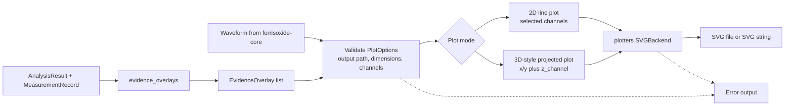

# ferrisoxide-plot Architecture

Date: 2026-06-06

## Responsibility

`ferrisoxide-plot` owns desktop SVG plotting for waveform analysis evidence. It renders selected waveform channels, optional evidence overlays from analysis results and measurements, and an optional simple 3D-style projection when `z_channel` is supplied.

## Non-Goals

- Interactive GUI plotting, plot-point caching, CSV parsing, transform execution, criteria evaluation, report rendering, hardware plotting, embedded plotting, or certification evidence.

## Public Boundary

| Area | Public API |
|---|---|
| Options | `PlotOptions`, `EvidenceOverlay` |
| Overlay mapping | `evidence_overlays` |
| Rendering | `render_svg`, `render_svg_string` |
| Errors | `PlotError`, `Result<T>` |

## Flowchart

## Important Error Paths

- Rendering rejects empty waveforms, missing selected channels, invalid width/height, invalid ranges caused by non-finite values, invalid output paths, and plotters render failures.
- Evidence overlays derive from matching measurement IDs; unmatched analysis results are skipped rather than fabricating overlay data.

## Validation

- `cargo test -p ferrisoxide-plot`
- `cargo clippy -p ferrisoxide-plot --all-targets -- -D warnings`
