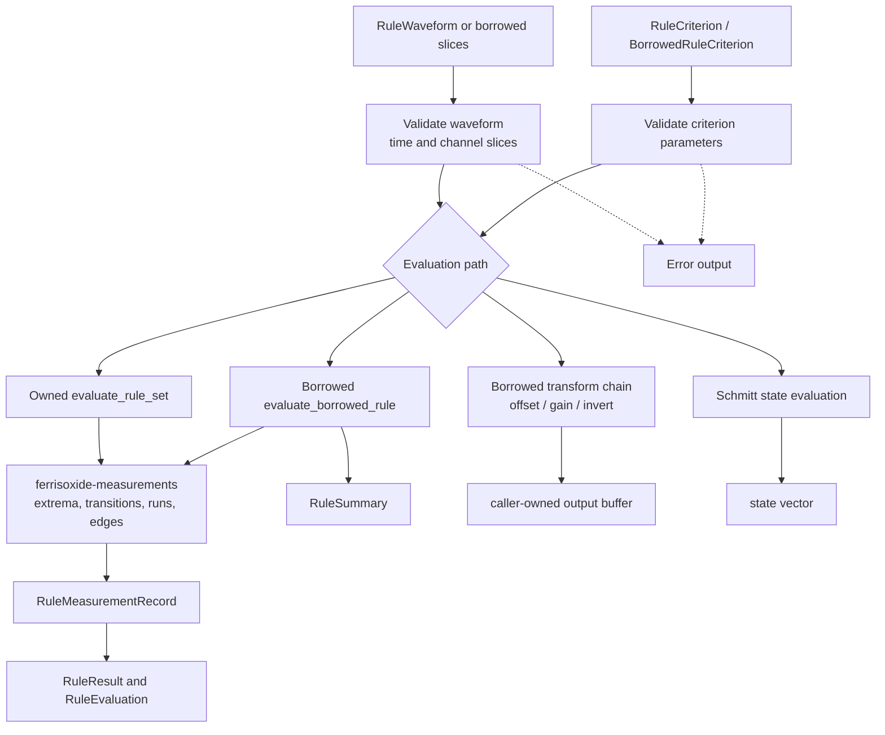

# ferrisoxide-rule-engine Architecture

Date: 2026-06-06

## Responsibility

`ferrisoxide-rule-engine` owns shared rule execution semantics over caller-provided time/sample slices. It supports owned desktop-style criteria evaluation, borrowed embedded-compatible criteria summaries, Schmitt state evaluation, and a small borrowed transform chain for supported runtime-package transforms.

## Non-Goals

- CSV/TOML parsing, report rendering, plotting, file I/O, DAQ/controller I/O, HALs, RTOS SDK integration, or certification claims.

## Public Boundary

| Area | Public API |
|---|---|
| Owned rules | `RuleWaveform`, `RuleChannel`, `RuleCriterion`, `RuleCriterionCheck`, `RuleEvaluation`, `evaluate_rule_set` |
| Borrowed rules | `BorrowedRuleCriterion`, `BorrowedRuleCriterionCheck`, `RuleSummary`, `evaluate_borrowed_rule` |
| Measurements | `RuleMeasurementRecord`, `RuleMeasurementSpec`, `RuleMeasurementRequirement`, run-selection config |
| Runtime transforms | `BorrowedTransformStep`, `apply_borrowed_transform_chain` |
| Schmitt states | `SchmittTriggerSpec`, `evaluate_schmitt_states`, `schmitt_next_state` |
| Errors | `RuleEngineError`, `BorrowedRuleError` |

## Flowchart

## Important Error Paths

- Empty input, missing channels, invalid waveform shape, non-finite data, output-buffer length mismatches, invalid tolerances, and invalid thresholds become `RuleEngineError` or `BorrowedRuleError`.
- Borrowed transform support is intentionally limited to `offset`, `gain`, and `invert`.

## Validation

- `cargo test -p ferrisoxide-rule-engine`
- `cargo test --workspace`
- `cargo clippy --workspace --all-targets -- -D warnings`
