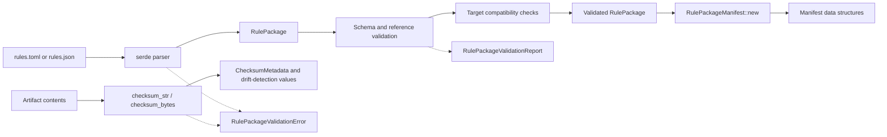

# ferrisoxide-rule-schema Architecture

Date: 2026-06-06

## Responsibility

`ferrisoxide-rule-schema` owns the versioned portable FerrisOxide rule package and manifest schema. It parses JSON/TOML into typed rule packages, validates package structure and target compatibility, and creates deterministic non-cryptographic checksum metadata for drift detection.

## Non-Goals

- Rule execution, CSV parsing, desktop reports, deployment package export, controller/DAQ behavior, RTOS/HAL integration, cryptographic signing, or certification evidence.

## Public Boundary

| Area | Public API |
|---|---|
| Package schema | `RulePackage`, `PackageMetadata`, `TargetProfile`, `ChannelDefinition`, `FilterDefinition`, `CriterionDefinition` |
| Manifest schema | `RulePackageManifest`, manifest source/validation/artifact/checksum types |
| Parsing | `parse_rule_package_json`, `parse_rule_package_toml` |
| Validation | `RulePackage::validate`, `validate_for_target`, `RulePackageValidationReport` |
| Checksums | `checksum_bytes`, `checksum_str`, `validate_checksum_match`, `validate_artifact_checksum` |
| Errors | `RulePackageValidationError`, `RulePackageValidationErrorKind` |

## Flowchart

## Important Error Paths

- Parse failures classify JSON/TOML input errors.
- Validation rejects schema-version mismatches, missing channels, duplicate identifiers, invalid sample timing, unsupported filters, invalid thresholds, and criteria references to missing channels.
- Checksums are deterministic drift-detection values only and are not signing or tamper-proofing.

## Validation

- `cargo test -p ferrisoxide-rule-schema`
- `cargo clippy -p ferrisoxide-rule-schema --all-targets -- -D warnings`
