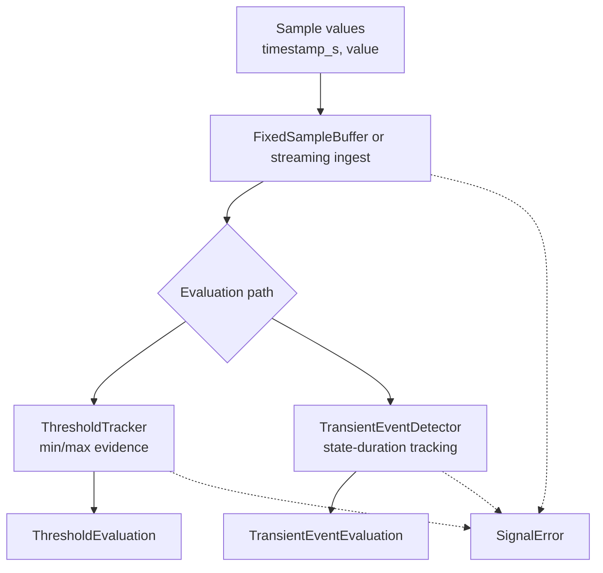

# ferrisoxide-signal Architecture

Date: 2026-06-06

## Responsibility

`ferrisoxide-signal` owns the smallest embedded-compatible signal primitives: fixed-capacity sample buffers, threshold tracking/evaluation, signal state classification, transient event detection, and one-shot transient evaluation helpers.

## Non-Goals

- File I/O, parsing, reporting, plotting, dynamic allocation, RTOS binding, hardware HALs, DAQ acquisition, controller output control, or certification evidence.

## Public Boundary

| Area | Public API |
|---|---|
| Samples | `Sample`, `FixedSampleBuffer<N>` |
| Thresholds | `ThresholdLimits`, `ThresholdTracker`, `ThresholdEvaluation`, `ThresholdEvidence`, `ThresholdCheck` |
| Transients | `TransientEventConfig`, `TransientEventDetector`, `TransientEventEvaluation`, `TransientEventKind`, `evaluate_transient_event` |
| States/errors | `SignalState`, `SignalError` |

## Flowchart

## Important Error Paths

- Fixed buffers reject over-capacity pushes and non-monotonic timestamps.
- Threshold evaluation rejects empty input and invalid min/max limit pairs.
- Transient detection rejects invalid thresholds and durations; empty input is reported through the adapter or helper path.

## Validation

- `cargo test -p ferrisoxide-signal`
- `cargo clippy -p ferrisoxide-signal --all-targets -- -D warnings`
