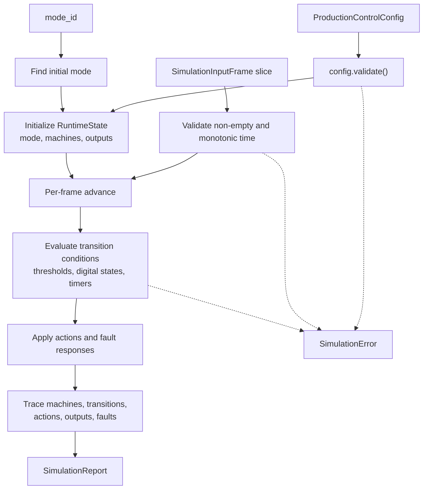

# ferrisoxide-simulator Architecture

Date: 2026-06-06

## Responsibility

`ferrisoxide-simulator` owns deterministic virtual controller simulation over `ferrisoxide-control-schema` production control configs and caller-provided input frames. It produces state-machine, transition, action, output, and fault traces for software workflow evidence.

## Non-Goals

- CSV parsing, live DAQ acquisition, hardware commands, HAL/RTOS SDK binding, real-time guarantees, plot rendering, deployment export, or certification evidence.

## Public Boundary

| Area | Public API |
|---|---|
| Inputs | `SimulationInputFrame`, `SimulatedInputValue` |
| Outputs | `SimulationReport`, `ControlStateTrace`, `StateMachineTrace`, `TransitionTrace`, `ActionTrace`, `OutputTrace` |
| Execution | `simulate_controller` |
| Errors | `SimulationError` |

## Flowchart

## Important Error Paths

- Simulation rejects invalid control config, empty frame input, non-monotonic time, missing or mistyped inputs, unknown modes/state machines/states, missing thresholds/actions/outputs/fault responses, non-finite analog input values, and invalid timer conditions.

## Validation

- `cargo test -p ferrisoxide-simulator`
- `cargo clippy -p ferrisoxide-simulator --all-targets -- -D warnings`
