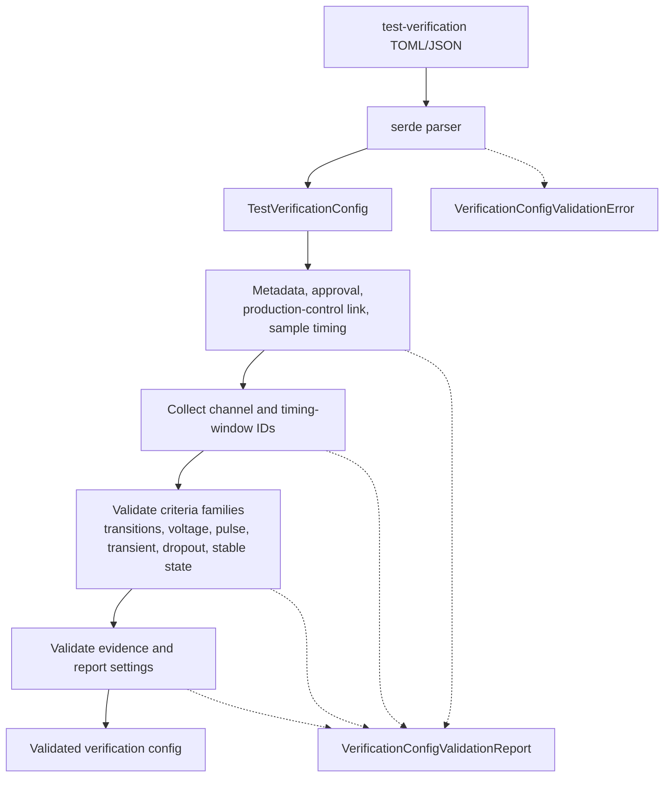

# ferrisoxide-verification-schema Architecture

Date: 2026-06-06

## Responsibility

`ferrisoxide-verification-schema` owns the versioned test verification config schema for qualification-style software workflows. It parses JSON/TOML and validates package metadata, optional production-control manifest linkage, approval metadata, sample timing, channels, timing windows, verification criteria, evidence requests, and report settings.

## Non-Goals

- Criteria execution, CSV parsing, controller simulation, SVG rendering, deployment package export, DAQ/hardware I/O, HALs, RTOS SDKs, or certification evidence.

## Public Boundary

| Area | Public API |
|---|---|
| Config root | `TestVerificationConfig`, `CURRENT_VERIFICATION_SCHEMA_VERSION` |
| Parsing | `parse_verification_config_json`, `parse_verification_config_toml` |
| Validation | `TestVerificationConfig::validate`, `VerificationConfigValidationReport` |
| Verification model | sample timing, channels, timing windows, transition/voltage/pulse/transient/dropout/stable-state requirements, evidence, report settings |
| Errors | `VerificationConfigValidationError`, `VerificationConfigValidationErrorKind` |

## Flowchart

## Important Error Paths

- Validation rejects schema-version mismatches, missing channels, missing criteria, duplicate identifiers, invalid sample timing, invalid windows, criteria referencing missing channels/windows, and invalid evidence/report settings.

## Validation

- `cargo test -p ferrisoxide-verification-schema`
- `cargo clippy -p ferrisoxide-verification-schema --all-targets -- -D warnings`
