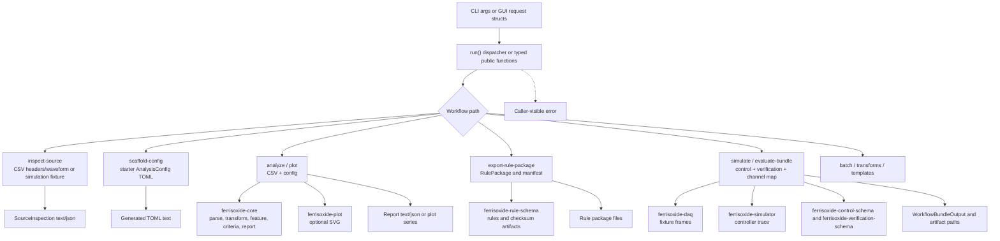

# ferrisoxide-workflow Architecture

Date: 2026-06-06

## Responsibility

`ferrisoxide-workflow` owns reusable desktop workflow orchestration for CLI and GUI callers. It converts command-style requests into source inspection, config scaffolding, analysis, plotting, rule-package export, simulation, batch execution, transform catalog output, workflow templates, and evaluation bundles.

## Non-Goals

- Native UI widgets, terminal entrypoint behavior, core transform implementation, schema ownership, live DAQ vendor SDKs, HAL/RTOS bindings, package signing, release publication, or certification evidence.

## Public Boundary

| Area | Public API |
|---|---|
| Command dispatcher | `run(args: Vec<String>) -> Result<String, String>` |
| Source workflow | `InspectSourceRequest`, `SourceInspection`, `inspect_source`, `load_csv_headers`, `render_source_inspection_output` |
| Config workflow | `ScaffoldConfigRequest`, `scaffold_csv_config`, workflow template APIs |
| Analysis workflow | `AnalyzeCsvRequest`, `analyze_csv` |
| Bundle workflow | `EvaluateBundleRequest`, `WorkflowBundleOutput`, `evaluate_bundle` |
| Plot workflow | `CsvPlotSeriesRequest`, `WorkflowPlotSeries`, `WorkflowPlotPoint`, `load_csv_plot_series` |
| Source modes | `WorkflowSourceMode::Csv`, `WorkflowSourceMode::Simulation` |

## Flowchart

## Important Error Paths

- Missing required CLI flags or request fields return `String` errors before file work begins.
- File reads, TOML/JSON parsing, config validation, waveform parsing, transform failures, report rendering, bundle directory conflicts, and artifact write failures are surfaced as caller-visible strings.
- Simulation workflows require control config, verification config, channel map, mode, and source data; missing or invalid inputs stop before bundle completion.
- `write_output_file` and related helpers protect against accidental overwrite unless overwrite is requested.

## Validation

- `cargo test -p ferrisoxide-workflow`
- `cargo test --workspace`
- `cargo clippy --workspace --all-targets -- -D warnings`
